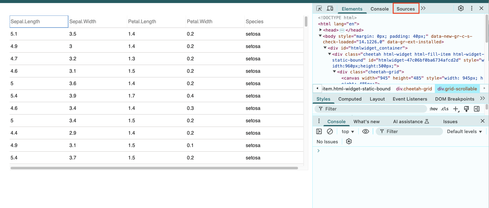
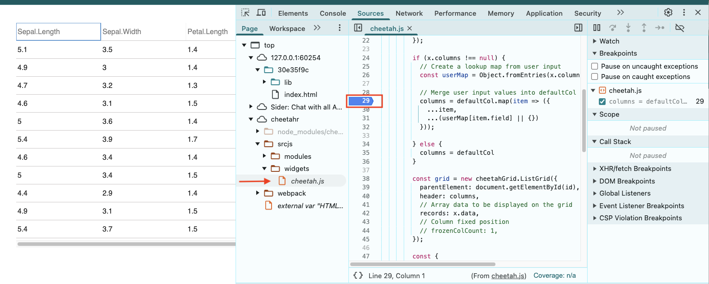

<!-- README.md is generated from README.Rmd. Please edit that file -->

# cheetahR

<!-- badges: start -->

[](https://CRAN.R-project.org/package=cheetahR)
[](https://lifecycle.r-lib.org/articles/stages.html#experimental)
<!-- badges: end -->

`cheetahR` is an R package that brings the power of [Cheetah
Grid](https://github.com/future-architect/cheetah-grid) to R. Designed
for **speed** and **efficiency**, `cheetahR` will allow you to **render
millions of rows** in just a few milliseconds, making it an excellent
alternative to reactable and other R table widgets. The goal of cheetahR
is to wrap the JavaScript functions of Cheetah Grid and make them
readily available for R users, providing a seamless and high-performance
table widget for R applications.

## Features

- **Ultra-fast** rendering of large datasets.
- **Lightweight** and efficient memory usage.
- **Customizable** styling and formatting.
- **Smooth** scrolling and interaction.
- **Seamless integration** with R and Shiny.

## Installation

You can install `cheetahR` from GitHub:

``` r
pak::pak("cynkra/cheetahR")
```

## Getting Started

So far, `cheetah()` is available to render a dataframe in R

``` r
library(cheetahR)

# Render table
cheetah(iris)

# Change some feature of some columns in the data
cheetah(
  iris,
  columns = list(
    Sepal.Length = column_def(name = "Sepal_Length"),
    Sepal.Width = column_def(name = "Sepal_Width", width = 100)
  )
)
```

## API Integration

`cheetahR` is compatible with Shiny, allowing for dynamic and
interactive tables in web applications. Although still a work in
progress.

## Contributing

We welcome contributions! If you’d like to help improve `cheetahR`, feel
free to submit issues, feature requests, or pull requests.

### Software Pre-requiste

To contribute to this project, some software installations are required,
such as `npm`, `node`, and `packer`. Please follow the slides attached
to help you get started
[pre-requisites](https://rsc.cynkra.com/js4Shiny/#/software-pre-requisites).
Click here to install
[packer](https://rsc.cynkra.com/js4Shiny/#/solutions).

When you are in the project, do the following:

``` r
packer::npm_install()
# Change the code and then rebundle
packer::bundle("development") # For developement mode
packer::bundle() # For production. Defaut!
```

You may as well bundle for `dev` using `packer::bundle_dev()` when in
developer mode and when ready for production use
`packer::bundle_prod()`. You may also consider `watch()` which watches
for changes in the `srcjs` and rebuilds if necessary, equivalent to
`⁠npm run watch⁠`.

### Debugging steps

1.  Once you run a function, for instance, `cheetah(iris)`, open the
    viewer on a web browser window (preferably Chrome as it is used to
    illustrate the action in this step). Note! Other browser pages may
    differ.
2.  Right-click on the widget and navigate to the “inspect” option on
    the drop-down menu 
3.  At the top, where the tabs are displayed, navigate to the “Sources”
    tab. Open from the sidepanel “cheetahr/srcjs/widgets/cheetah.js”
    script 
4.  Once the “cheetah.js” is opened on the main panel. You can set a
    breakpoint on any line number of the script and reload the page.
    

## Acknowledgments

This package is built on top of the amazing [Cheetah
Grid](https://github.com/future-architect/cheetah-grid) JavaScript
library.
