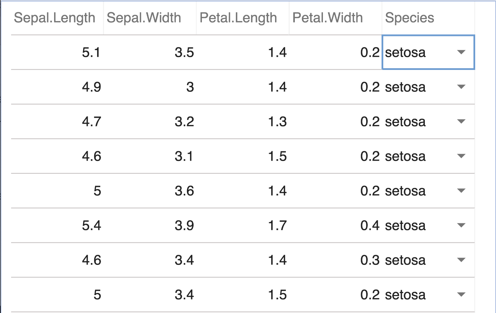
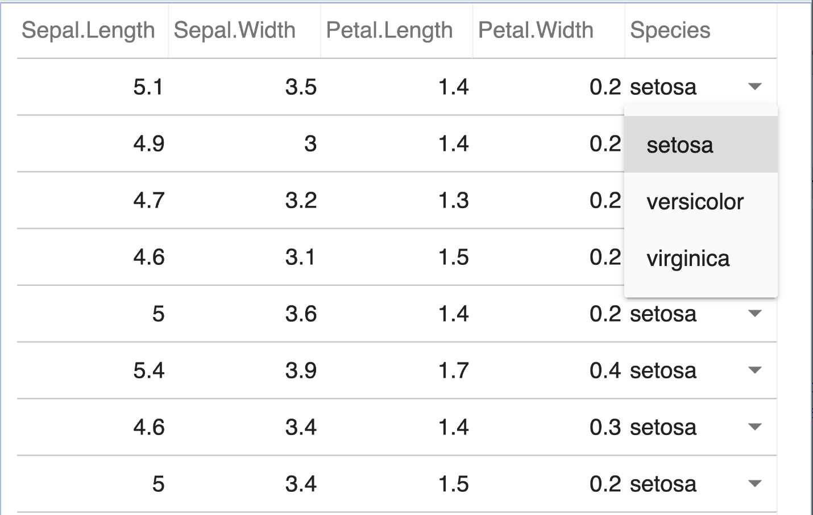
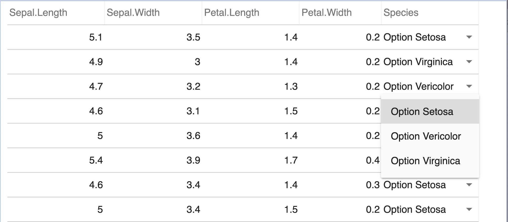

# Get Started

``` r

library(cheetahR)
library(palmerpenguins)
library(dplyr)
```

## Your first table

``` r

# Render table
cheetah(iris)
```

## Customize columns

``` r

# Change some feature of some columns in the data
cheetah(
  iris,
  columns = list(
    Sepal.Length = column_def(name = "Sepal_Length", width = 120),
    Sepal.Width = column_def(name = "Sepal_Width", width = 120),
    Petal.Length = column_def(name = "Petal_Length", width = 120),
    Petal.Width = column_def(name = "Petal_Width", width = 120),
    Species = column_def(name = "Species")
  )
)
```

## Customize `rownames`

The default for the row names column is `TRUE` if present in the data;
however, to modify it, include a column definition with “rownames” as
the designated column name.

``` r

# Example of customizing rownames with color and width
cheetah(
  mtcars,
  columns = list(
    rownames = column_def(width = 150, style = list(color = "red"))
  )
)
```

## Defining the column types

The `column_type` parameter in
[`column_def()`](../reference/column_def.md) allows you to specify
different types of columns. There are 6 possible options:

- `"text"`: For text columns
- `"number"`: For numeric columns
- `"check"`: For checkbox columns
- `"image"`: For image columns
- `"radio"`: For radio button columns
- `"multilinetext"`: For multiline text columns
- `"menu"`: For dropdown menu selection columns

The `column_type` parameter is optional. If it is not specified, the
column type will be inferred from the data type.

``` r

# Using checkbox column type to indicate NA values
head(airquality, 10) %>%
  mutate(
    has_na = if_any(everything(), is.na),
    has_na = ifelse(has_na, "true", "false"),
    .before = 1
  ) %>%
  cheetah(
    columns = list(
      has_na = column_def(
        name = "Contains NA",
        column_type = "check",
        style = list(
          uncheckBgColor = "#FDD",
          checkBgColor = "rgb(255, 73, 72)",
          borderColor = "red"
        )
      )
    )
  )
```

Note! The check column is not clickable. This is because a corresponding
value of “check” is required for the action parameter to activate the
interactivity of the column.

## Defining the column actions

The `action` parameter in [`column_def()`](../reference/column_def.md)
allows you to define interactive behaviors for columns. There are 4
possible actions:

- `"input"`: Makes the column editable with text input
- `"check"`: Makes the column editable with checkboxes
- `"radio"`: Makes the column editable with radio buttons
- `"inline_menu"`: Makes the column editable with a dropdown menu
  (requires `column_type = "menu"` and `menu_options`)

The action type must be compatible with the column type. For example,
`"check"` action can only be used with `"check"` column type.

``` r

head(airquality, 10) %>%
  mutate(
    has_na = if_any(everything(), is.na),
    has_na = ifelse(has_na, "true", "false"),
    .before = 1
  ) %>%
  cheetah(
    columns = list(
      has_na = column_def(
        name = "Contains NA",
        column_type = "check",
        action = "check",
        style = list(
          uncheckBgColor = "#FDD",
          checkBgColor = "rgb(255, 73, 72)",
          borderColor = "red"
        )
      )
    )
  )
```

### Adding image to the table

The `cheetah` widget supports displaying images in table cells by
setting `column_type = "image"`. You can customize how images are
displayed using style properties like `imageSizing`.

``` r

img_url <- c(
"https://assets.shannons.com.au/JD166AU033OKSAEF/Z8E73PWLE94D365M/7g7i8dxq4xdx0g61-me9867ab4krp0uio/jpg/2000x1500x3/vehicle/1973-mazda-rx4.jpg",
"https://live.staticflickr.com/2529/3854349010_4783baf575_o.jpg",
"https://photos.classiccars.com/cc-temp/listing/129/6646/18583131-1974-datsun-710-std.jpg",
"https://tse2.mm.bing.net/th?id=OIP.qV1ZAVktze35RwUpEgtPmwAAAA&pid=Api&P=0&h=180",
"https://tse1.mm.bing.net/th?id=OIP.OA_V14TTdu8nx36mC6VUeAHaEo&pid=Api&P=0&h=180",
"https://res.cloudinary.com/carsguide/image/upload/f_auto,fl_lossy,q_auto,t_cg_hero_low/v1/editorial/dp/albums/album-3483/lg/Valiant-50-years-_6_.jpg"
)
```

``` r

data <- mutate(head(mtcars), image = img_url, .before = 1) 
cheetah(
  data,
  columns = list(
    rownames = column_def(width = 150),
    image = column_def("images", width = 100, column_type = "image", style = list(imageSizing = "keep-aspect-ratio" ))
  )
)
```

## Cell messages

There are two ways to add **cell messages** for validation

1.  Define **cell messages** by passing a JS function wrapped within
    `htmlwidget::JS()`. This function takes a single parameter `rec`
    which refers to data row. It must return an object with 2
    properties:

- `type`: the message type. Valid types are `"info"`, `"warning"` and
  `"error"`.
- `message`: the message content. As shown below, you can use a
  [**ternary
  operator**](https://developer.mozilla.org/en-US/docs/Web/JavaScript/Reference/Operators/Conditional_operator)
  to check whether a condition is respected, for instance
  `rec.Species === 'setosa'` check if the recorded specie is `"setosa"`.
  Since `rec` refers to an entire data row, you can also target multiple
  columns in your check logic.

``` r

cheetah(
  iris,
  columns = list(
    Species = column_def(
      action = "input",
      message = htmlwidgets::JS(
        "function(rec) {
          return {
            type: 'error',
            message: rec.Species === 'setosa' ? 'Invalid specie type.' : null,
          }
        }"
      )
    )
  )
)
```

2.  Using [`add_cell_message()`](../reference/add_cell_message.md). A R
    helper function which provides a simpler interface to create cell
    messages. The function takes two arguments:

- `type`: Message type (`"error"`, `"warning"`, or `"info"`). Defaults
  to `"error"`.
- `message`: A string or JavaScript expression. If the message contains
  `rec.`, `?`, `:`, or ends with `;`, it is treated as raw JavaScript.
  Otherwise, it is escaped and wrapped in quotes.

Here are some examples:

``` r

# Prepare data
set.seed(123)
iris_rows <- sample(nrow(iris), 10)
data <- iris[iris_rows, ]
```

``` r

# Simple cell message
cheetah(
  data,
  columns = list(
    Species = column_def(
      action = "input",
      message = add_cell_message(type = "info", message = "Ok")
    )
  )
)
```

### Cell message using `js_ifelse()`

The [`js_ifelse()`](../reference/js_ifelse.md) helper function provides
a convenient way to write conditional JavaScript expressions in R. It
follows the same syntax as R’s
[`ifelse()`](https://rdrr.io/r/base/ifelse.html) function but generates
JavaScript code for use in cell messages. See possible examples:

#### 1. Simple logic: numeric comparisons and equality

``` r

cheetah(
  data,
  columns = list(
    Species = column_def(
      action = "input",
      message = add_cell_message(message = js_ifelse(Species == "setosa", "", "Invalid"))
    )
  )
)
```

``` r

cheetah(
  data,
  columns = list(
    Species = column_def(
      action = "input",
      message = add_cell_message(
        type = "warning",
        message = js_ifelse(Sepal.Length > 5, "BigSepal", "")
      )
    )
  )
)
```

``` r

cheetah(
  data,
  columns = list(
    Species = column_def(
      action = "input",
      message = add_cell_message(
        type = "warning",
        message = js_ifelse(Sepal.Width <= 3, "NarrowSepal", "WideSepal")
      )
    )
  )
)
```

#### 2. Combined logic

``` r

cheetah(
  data,
  columns = list(
    Species = column_def(
      action = "input",
      message = add_cell_message(
        type = "info",
        message = js_ifelse(Sepal.Length > 5 & Species %notin% c("setosa"), "E", "X")
      )
    )
  )
)
```

#### 3. Basic `%in%` and `%notin%`

``` r

cheetah(
  data,
  columns = list(
    Species = column_def(
      action = "input",
      message = add_cell_message(
        message = js_ifelse(Species %in% c("setosa", "virginica"), "Bad")
      )
    )
  )
)
```

``` r

cheetah(
  data,
  columns = list(
    Species = column_def(
      action = "input",
      message = add_cell_message(
        type = "info",
        message = js_ifelse(Species %notin% c("setosa"), "OK")
      )
    )
  )
)
```

#### 4. Using `grepl()` and `!grepl()`

``` r

cheetah(
  data,
  columns = list(
    Species = column_def(
      action = "input",
      message = add_cell_message(
        type = "info",
        message = js_ifelse(grepl("^vir", Species), "Yes")
      )
    )
  )
)
```

``` r

cheetah(
  data,
  columns = list(
    Species = column_def(
      action = "input",
      message = add_cell_message(
        type = "warning",
        message = js_ifelse(!grepl("set", Species), "NoSet", "")
      )
    )
  )
)
```

#### 5. Truthiness of a bare variable

The [`js_ifelse()`](../reference/js_ifelse.md) function can check the
truthiness of a variable directly, similar to JavaScript’s truthy/falsy
behavior. Empty strings, `NA`, `null`, and `undefined` are considered
falsy values, while non-empty strings and other values are considered
truthy. This is useful for simple existence checks.

``` r

# Add an extra column to the data
check <-
  c(
    "", NA,
    "ok", NA,
    "good", "",
    "", "good",
    "ok", "better"
  )

data <- mutate(data, Check = check, .before = 1)

cheetah(
  data,
  columns = list(
    Check = column_def(
      name = "",
      column_type = "check",
      action = "check",
      message = add_cell_message(
        message = js_ifelse(Check, if_false = "Please check.")
      )
    )
  )
)
```

### Cell message using raw JS expression as string

Finally, within [`add_cell_message()`](../reference/add_cell_message.md)
you can pass raw JavaScript expressions as strings to the `message`
option. In this case, you can either pass the JavaScript string directly
or wrap it in
[`htmlwidgets::JS()`](https://rdrr.io/pkg/htmlwidgets/man/JS.html). The
JavaScript expression should evaluate to a string that will be displayed
as the message.

``` r

cheetah(
  data[,-1],
  columns = list(
    Sepal.Width = column_def(
      action = "input",
      style = list(textAlign = "center"),
      message = add_cell_message(
        type = "warning",
        message = "rec['Sepal.Width'] <= 3 ? 'NarrowSepal' : 'WideSepal';"
      )
    )
  )
)
```

## Column Formatting in cheetah

cheetah provides powerful column formatting capabilities through the
JavaScript Intl API, allowing you to format numbers, dates, and other
data types with locale-aware settings.

### Numeric column formatting

The [`number_format()`](../reference/number_format.md) helper function
allows you to format numeric columns using the JavaScript
`Intl.NumberFormat` API. This provides locale-aware number formatting
with support for currencies, units, percentages and more.

Below is an example showing various number formatting options:

``` r

numeric_data <- data.frame(
  price_USD = c(125000.75, 299.99, 7890.45),
  price_EUR = c(410.25, 18750.60, 1589342.80),
  price_INR = c(2200.50, 134999.99, 945.75),
  price_NGN = c(120000, 2100045, 1750),
  liter = c(20, 35, 42),
  percent = c(0.875, 0.642, 0.238)
)

cheetah(
  numeric_data,
  columns = list(
    price_USD = column_def(
      name = "USD",
      column_type = number_format(
        style = "currency",
        currency = "USD"
      )
    ),
    price_EUR = column_def(
      name = "EUR",
      column_type = number_format(
        style = "currency",
        currency = "EUR",
        locales = "de-DE"
      )
    ),
    price_INR = column_def(
      name = "INR",
      column_type = number_format(
        style = "currency",
        currency = "INR",
        locales = "hi-IN"
      )
    ),
    price_NGN = column_def(
      name = "NGN",
      column_type = number_format(
        style = "currency",
        currency = "NGN"
      )
    ),
    liter = column_def(
      name = "Liter",
      column_type = number_format(
        style = "unit",
        unit = "liter",
        unit_display = "long"
      )
    ),
    percent = column_def(
      name = "Percent",
      column_type = number_format(style = "percent")
    )
  )
)
```

### Date column formatting

Similar to number formatting, cheetahR provides a
[`date_format()`](../reference/number_format.md) function to format date
columns according to the locale-specific conventions. You can customize
the display of date components like day, month, year, hour, minute, etc.
and specify the locale:

``` r

cheetah(
  data.frame(
    date = as.Date(c("2023-01-15", "2023-02-28", "2023-03-10")),
    datetime = as.POSIXct(c(
      "2023-01-15 09:30:00", 
      "2023-02-28 14:45:00",
      "2023-03-10 18:15:00"
    ))
  ),
  columns = list(
    date = column_def(
      name = "Date",
      column_type = date_format(
        locales = "en-US",
        month = "long",
        day = "numeric",
        year = "numeric"
      )
    ),
    datetime = column_def(
      name = "Date & Time",
      column_type = date_format(
        locales = "de-DE",
        date_style = "full",
        time_style = "medium"
      )
    )
  )
)
```

## Sorting options in cheetahR

By default a cheetahR table is sortable. Otherwise, set
`sortable = FALSE` in [`cheetah()`](../reference/cheetah.md) to disable
this functionality:

``` r

cheetah(mtcars, rownames = FALSE, sortable = FALSE)
```

However, to indivdually control the sorting option of each columns in
the table, pass `sort = TRUE` to the
[`column_def()`](../reference/column_def.md):

``` r

cheetah(
  mtcars,
  sortable = FALSE,
  columns = list(
    rownames = column_def(
      width = 150,
      sort = TRUE
    )
  )
)
```

### Coming soon (TBD)

If you want finer control over the sorting logic and provide your own,
you can pass a
[`htmlwidgets::JS`](https://rdrr.io/pkg/htmlwidgets/man/JS.html)
callback instead:

``` r

cheetah(
  mtcars,
  sortable = FALSE,
  columns = list(
    rownames = column_def(
      width = 150,
      sort = htmlwidgets::JS(
        "function(order, col, grid) {
          // your logic
        }"
      )
    )
  )
)
```

## Column Grouping

cheetahR allows you to group related columns together under a common
header using [`column_group()`](../reference/column_group.md). This
creates a hierarchical structure in your table headers, making it easier
to organize and understand related data.

To group columns, use the
[`column_group()`](../reference/column_group.md) function to define each
group and specify which columns belong to it. Then pass the list of
column groups to the `column_group` parameter in
[`cheetah()`](../reference/cheetah.md).

Here’s an example grouping the Sepal and Petal measurements in the iris
dataset:

``` r

cheetah(
  iris,
  columns = list(
    Sepal.Length = column_def(name = "Length"),
    Sepal.Width = column_def(name = "Width"),
    Petal.Length = column_def(name = "Length"),
    Petal.Width = column_def(name = "Width")
  ),
  column_group = list(
    column_group(
      name = "Sepal",
      columns = c("Sepal.Length", "Sepal.Width"),
      header_style = list(textAlign = "center", bgColor = "#fbd4dd")
    ),
    column_group(
      name = "Petal",
      columns = c("Petal.Length", "Petal.Width"),
      header_style = list(textAlign = "center", bgColor = "#d8edfc")
    )
  )
)
```

## Extending the `theme` option in a cheetah table

The `theme` parameter allows you to extensively customize the visual
appearance of your cheetah table by providing a named list of styling
options. You can modify colors, borders, fonts and other visual
properties.

Here’s an example showing some theme customizations:

``` r

# Define a named list of styles
user_theme <- list(
  color = "#2c3e50",
  frozenRowsColor = "#2c3e50",
  defaultBgColor = "#ecf0f1",
  frozenRowsBgColor = "#bdc3c7",
  selectionBgColor = "#d0ece7",
  highlightBgColor = "#f9e79f",
  underlayBackgroundColor = "#f4f6f7",
  # This is also possible to change the theme apply in the state by using callback.
  frozenRowsBorderColor = '
  function(args) {
   const { row, grid: { frozenRowCount } } = args;
    if (frozenRowCount - 1 === row) {
     return ["#7f8c8d", "#7f8c8d", "#34495e"];
    } else {
     return "#7f8c8d";
    }
  }',
  borderColor = '
  function(args) {
   const { col, grid: { colCount } } = args;
    if (colCount - 1 === col) {
     return ["#34495e", "#7f8c8d", "#34495e", null];
    } else {
     return ["#34495e", null, "#34495e", null];
    }
  }',
  highlightBorderColor = "#1abc9c",
  checkbox = list(
    uncheckBgColor = "#ecf0f1",
    checkBgColor = "#1abc9c",
    borderColor = "#16a085"
  ),
  font = "14px 'Helvetica Neue', sans-serif",
  header = list(sortArrowColor = "#2980b9"),
  messages = list(
    infoBgColor = "#95a5a6",
    errorBgColor = "#e74c3c",
    warnBgColor = "#f1c40f",
    boxWidth = 12,
    markHeight = 15
  )
)
```

Apply the custom theme to the table:

``` r

cheetah(
  data,
  theme = user_theme,
  columns = list(
    Check = column_def(
      name = "",
      column_type = "check",
      action = "check",
      message = add_cell_message(
        message = js_ifelse(Check, if_false = "Please check.")
      )
    ),
    Petal.Width = column_def(
      action = "input",
      style = list(textAlign = "center"),
      message = add_cell_message(
        type = "info",
        message = js_ifelse(Petal.Width <= 1, "NarrowPetal", "WidePetal")
      )
    ),
    Species = column_def(
      action = "input",
      message = add_cell_message(
        type = "warning",
        message = js_ifelse(!grepl("set", Species), "NoSet", "")
      )
    )
  )
)
```

## Filtering data

You can filter data by setting `search` to either `exact` or `contains`
when you call [`cheetah()`](../reference/cheetah.md) like so:

``` r

cheetah(penguins, search = "contains")
```

  

## Further customizing options

The [`cheetah()`](../reference/cheetah.md) function provides several
additional options to customize the grid’s appearance and behavior:

- `disable_column_resize`: Prevent users from resizing columns

``` r

# Disable resize effect in a cheetah table
cheetah(penguins, search = "contains", disable_column_resize = TRUE)
```

  

- `column_freeze`: Freeze a number of columns from the left

``` r

# Freeze the first column
cheetah(penguins, search = "contains", column_freeze = 1)
```

  

- `default_row_height` and `default_col_width`: Set default sizes for
  rows and columns

``` r

# Define default row height and column width
cheetah(penguins, search = "contains", default_row_height = 30, default_col_width = 100)
```

  

- `header_row_height`: Customize the height of the header row

``` r

# Define default row height for the header
cheetah(penguins, search = "contains", header_row_height = 20)
```

  

- `font`: Set custom font properties according to the standard CSS
  shorthand declaration for font settings.

``` r

# Define a default font setting for the table
cheetah(penguins, search = "contains", font = "8px sans-serif")
```

  

- `editable`: Enable or disable cell editing in the grid. When set to
  `TRUE`, users can double-click cells to edit their values.

``` r

# Make the table editable
cheetah(penguins, search = "contains", editable = TRUE)
```

  

- `keyboard_options`: Configure keyboard navigation and shortcuts

``` r

# Move cells on tab and delete cell values on with the Delete and BackSpace keys
cheetah(
  penguins,
  search = "contains",
  editable = TRUE,
  keyboard_options =
    list(
      deleteCellValueOnDel = TRUE,
      moveCellOnTab = TRUE
    )
)
```

Note: To active `deleteCellValueOnDel`, ensure `editable = TRUE` or a
specified column is editable.

## `cheetah()` usage in Shiny

cheetahR works seamlessly in a Shiny app. You can use it in both the UI
and server components. In the UI, simply call
[`cheetahR::cheetahOutput()`](../reference/cheetah-shiny.md) to create a
placeholder for the grid. In the server, use
[`cheetahR::renderCheetah()`](../reference/cheetah-shiny.md) to render
the grid with your data and options.

The grid will automatically update when the underlying data changes,
making it perfect for reactive applications. All features like
filtering, sorting, and custom column definitions work exactly the same
way as in standalone R usage.

One special feature that works particularly well in Shiny is the `menu`
column type, which allows users to select from predefined options in a
dropdown menu. This is ideal for interactive data editing workflows.

## Menu column in Shiny

By default, [`cheetah()`](../reference/cheetah.md) automatically detects
any “factor” columns in your data and converts them into menu columns. A
menu column displays a dropdown menu with predefined options that users
can select from. This is particularly useful when you want to restrict
input to a specific set of valid choices. For example, if you have a
factor column with levels “Low”, “Medium”, and “High”, it will be
displayed as a dropdown menu with these three options.

``` r

library(shiny)
library(bslib)
library(cheetahR)


ui <- page_fluid(cheetahOutput("grid"))

server <- function(input, output) {
  output$grid <- renderCheetah({
    cheetah(data = iris)
  })
}

shinyApp(ui = ui, server = server)
```



Default menu column sample 1



Default menu column sample 2

### Customizing the ‘menu options’

``` r

library(shiny)
library(bslib)
library(cheetahR)

ui <- page_fluid(cheetahOutput("grid"))

server <- function(input, output) {
  output$grid <- renderCheetah({
    cheetah(data = iris,
            columns = list(
              Species = column_def(
                column_type = "menu",
                action = "inline_menu",
                menu_options = list(
                  setosa = "Option Setosa",
                  versicolor = "Option Vericolor" ,
                  virginica = "Option Virginica"
                )
              )
            )
          )
  })
}

shinyApp(ui = ui, server = server)
```



Customized menu column sample

## Autocomplete column in Shiny

An **autocomplete column** behaves like a text field that suggests
matching values from a fixed list as the user types — similar to the
dropdown you see when typing into a search bar. It is the right choice
when you want users to enter a value but only from a known pool of
options that is too large to display as a regular menu (think country
names, product SKUs, currency codes).

How it differs from the other interactive column types:

- `action = "input"` — free text, no suggestions.
- `action = "inline_menu"` — closed list of choices presented as a
  dropdown; user picks one and cannot type a new value.
- `action = "autocomplete"` — user types, sees suggestions filtered
  against `auto_complete_opts`, and can either pick a suggestion or
  commit their own text.

To turn a column into an autocomplete column, pass two arguments to
[`column_def()`](../reference/column_def.md):

- `action = "autocomplete"`
- `auto_complete_opts = <character vector of suggestions>`

The target column must be of class `character`. Factor and numeric
columns are rejected with a clear error so the configuration cannot
silently go wrong.

### Keyboard behavior

Once a cell is open for editing, the autocomplete editor responds to:

- **Typing** — filters `auto_complete_opts` (case-insensitive `includes`
  match) and displays at most 10 matches.
- **↑ / ↓** — highlights the previous/next suggestion in the dropdown.
- **Enter** — commits the highlighted suggestion if one is highlighted;
  otherwise commits whatever the user typed.
- **Tab** — same commit behavior as Enter; if
  `keyboard_options = list(moveCellOnTab = TRUE)` is set on the grid,
  the selection then moves to the next cell.
- **Escape** — discards the edit and closes the editor without changing
  the cell.
- **Clicking a suggestion** — commits that suggestion.
- **Clicking elsewhere (blur)** — commits the current text.

When a cell commits, the grid fires its standard `CHANGED_VALUE` event,
so `input$grid_changed_value` and
[`get_grid_data()`](../reference/get_grid_data.md) both update
reactively as with any other editable column.

### A complete example

``` r

library(shiny)
library(cheetahR)

# Pool of values the user can pick from.
countries <- c(
  "Argentina", "Australia", "Brazil", "Canada", "Chile", "China",
  "Denmark", "Egypt", "France", "Germany", "Ghana", "India",
  "Indonesia", "Ireland", "Italy", "Japan", "Kenya", "Mexico",
  "Netherlands", "Nigeria", "Norway", "Portugal", "Spain", "Sweden",
  "Switzerland", "Uganda", "United Kingdom", "United States"
)

# Data must have a character `country` column for the autocomplete editor.
data <- data.frame(
  id = 1:6,
  country = c("France", "Germany", "Ghana", "India", "Italy", "Japan"),
  population_m = c(67, 84, 33, 1428, 59, 125),
  stringsAsFactors = FALSE
)

ui <- fluidPage(
  h4("Autocomplete editor"),
  helpText(
    "Click a cell in 'country', start typing to filter the suggestions,",
    "then press Enter (or Tab) to commit. Press Escape to cancel."
  ),
  cheetahOutput("grid"),
  h5("Last changed cell"),
  verbatimTextOutput("last_change"),
  h5("Current data state"),
  verbatimTextOutput("data_state")
)

server <- function(input, output, session) {
  output$grid <- renderCheetah({
    cheetah(
      data,
      editable = TRUE,
      rownames = FALSE,
      # Optional: let Tab also move the selection to the next cell.
      keyboard_options = list(moveCellOnTab = TRUE),
      columns = list(
        country = column_def(
          action = "autocomplete",
          auto_complete_opts = countries
        )
      )
    )
  })

  # Reactive: most recent single-cell edit.
  output$last_change <- renderPrint({
    req(input$grid_changed_value)
    input$grid_changed_value
  })

  # Reactive: the full grid as a data frame, updated after every edit.
  output$data_state <- renderPrint({
    req(get_grid_data("grid"))
  })
}

shinyApp(ui, server)
```

### Common gotchas

- **Suggestion list must be a character vector.** Numbers or factors
  will not filter correctly; convert with
  [`as.character()`](https://rdrr.io/r/base/character.html) if needed.
- **Target column must be `character`.** If you build it from
  `data.frame(...)`, remember to pass `stringsAsFactors = FALSE` (R ≥
  4.0 defaults to this, but be explicit when in doubt).
- **The dropdown shows at most 10 matches**, so users may need to narrow
  their query if the pool is large. This is a deliberate cap to keep the
  UI responsive.
- **Outside Shiny**, the editor still renders in standalone widgets, but
  the value-change event is only consumed by Shiny — there is no
  callback to listen to in static reports.
